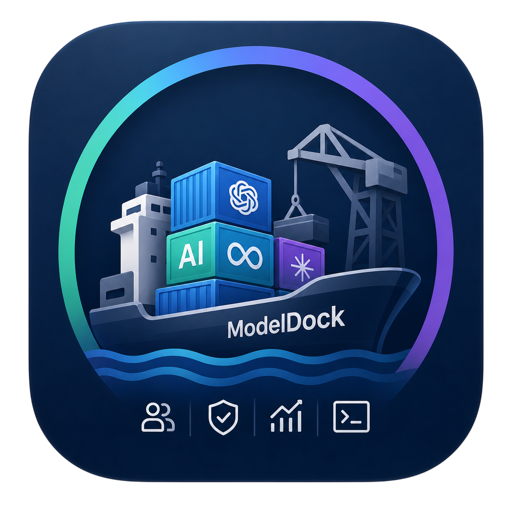

[English](README.md) | [한국어](README.ko.md) | [中文](README.zh.md) | 日本語 | [Español](README.es.md) | [Tiếng Việt](README.vi.md) | [Português](README.pt.md)

# ModelDock

[](https://www.npmjs.com/package/modeldock)
[](https://www.npmjs.com/package/@modeldock/cli)
[](LICENSE)



ModelDock は、LiteLLM を基盤にしたセルフホスト型マルチユーザー LLM アプリ向けのオープンソース control plane です。
プロバイダー接続、BYOK 認証情報、クレジット、予算、LiteLLM ルーティング、チャット UI、管理ワークフロー、MCP、スキル、デプロイテンプレートを 1 つのサービスとしてまとめます。

ModelDock は単なるチャット画面ではありません。安全な onboarding、ユーザー別 provider 認証情報、クレジット、予算、承認ゲート、LiteLLM orchestration、管理画面分離、ローカル既定のデプロイモードなど、運用者の問題から始まります。

## ModelDock とは

ModelDock は、プライベートな LLM サービスを運用するためのサービス運用レイヤーです。ユーザーは自分の OpenAI、Anthropic、Gemini、OpenRouter、Ollama、vLLM、または OpenAI 互換キーを接続でき、運用者はユーザーごとのクレジット、予算、モデル権限、監査ログ、安全なデプロイ既定値を管理できます。

ModelDock はモデルプロバイダーでも決済処理サービスでもありません。プロバイダーの規約、課金、レート制限を回避するためのツールではありません。安定した接続モデルは、ユーザー所有 API キー、サーバー運用者が設定するプラットフォームキー、OpenAI 互換エンドポイント、LiteLLM 対応プロバイダーです。

## アーキテクチャ

```text
Browser
  -> Web App
      -> ユーザー向けチャット UI、プロバイダー設定、クレジットダッシュボード
  -> Public API
      -> 認証、ユーザープロファイル、チャット保存、BYOK vault、クレジット台帳
  -> LiteLLM Proxy
      -> OpenAI / Anthropic / Gemini / OpenRouter / Ollama / vLLM / その他
  -> Admin App
      -> ユーザー、クレジット、プロバイダー、LiteLLM 状態、監査ログ、システム設定
```

LiteLLM 連携は `packages/litellm` に分離されており、LiteLLM の更新をアプリ全体へ広げずに扱える設計です。

## クイックスタート

```bash
pnpm install
pnpm lint
pnpm typecheck
pnpm test
pnpm build
cp .env.example .env
docker compose config
docker compose up -d
```

既定のローカルエンドポイント:

```text
Web app:   http://127.0.0.1:3000
Admin app: http://127.0.0.1:3001
API:       http://127.0.0.1:3002
LiteLLM:   既定では Docker 内部ネットワークのみ
Postgres:  既定では Docker 内部ネットワークのみ
```

## セキュリティ既定値

- アプリ、管理アプリ、API は明示的に公開しない限り localhost にのみ bind します。
- 管理画面はユーザーアプリとは別の保護されたホストで運用します。
- 公開ユーザー登録は既定で無効です。
- プロバイダーキーなしでアプリを起動できます。
- 本番モードでは予測可能なプレースホルダー secret を拒否する必要があります。
- LiteLLM master key と管理トークンをブラウザへ送信してはいけません。
- チャット内容、プロバイダーキー、OAuth token、session token、authorization header、MCP secret payload は既定でログに残しません。

## Debug mode と Release mode

Debug mode は localhost テスト用です。active owner/admin が存在しない場合、最初の管理者は `admin/admin` として作成され、初回ログイン後に ID または email と password の変更画面へ移動します。キャンセルはできますが、既定 credential は残るため短時間のローカル検証に限定してください。

Release mode は実ドメイン接続用です。`admin/admin` は作成されず、空の管理 allowlist は fail closed します。Kubernetes service は既定で `ClusterIP` のままにし、まず一般ユーザー画面のみを公開します。

管理アクセスは許可 IP または device fingerprint のどちらかが一致すると通過します。ブラウザは実際の client MAC address を安定して提供できないため、MAC 項目は運用者管理の device fingerprint として扱います。

## サインアップ承認

ユーザーは Web app から登録リクエストを送り、owner または admin が Admin app で承認してからサービスを利用できます。

## 多言語 UI

ページ言語は Cloudflare `CF-IPCountry`、ブラウザ `Accept-Language`、英語 fallback の順に解決します。現在は README 翻訳と同じく英語、韓国語、中国語、日本語、スペイン語、ベトナム語、ポルトガル語に対応します。

## 主要領域

| 領域 | 状態 |
| --- | --- |
| LiteLLM ルーティング | 必須インフラ |
| BYOK credential vault | 暗号化保存設計 |
| クレジットと予算 | ModelDock 台帳 + LiteLLM 予算マッピング |
| チャットとフォルダー | サーバー保存モードとローカル専用モード |
| RAG | Weaviate、Redis、PostgreSQL、S3 互換ストレージ |
| MCP とスキル | ユーザー別設定、権限プロンプト、監査メタデータ |
| 管理アプリ | 別ホスト保護と role-based access control |

## ドキュメント

- [Docker デプロイ](docs/deployment/docker.md)
- [クイックスタート](docs/quickstart.md)
- [管理者ガイド](docs/admin-guide.md)
- [ユーザーガイド](docs/user-guide.md)
- [Debug/Release mode](docs/deployment/modes.md)
- [Cloudflare デプロイ](docs/deployment/cloudflare.md)
- [LiteLLM 連携](docs/litellm.md)
- [セキュリティモデル](docs/security.md)
- [BYOK](docs/byok.md)
- [プロバイダー文書](docs/providers/README.md)

## ライセンス

ModelDock は [MIT License](LICENSE) で公開されています。
